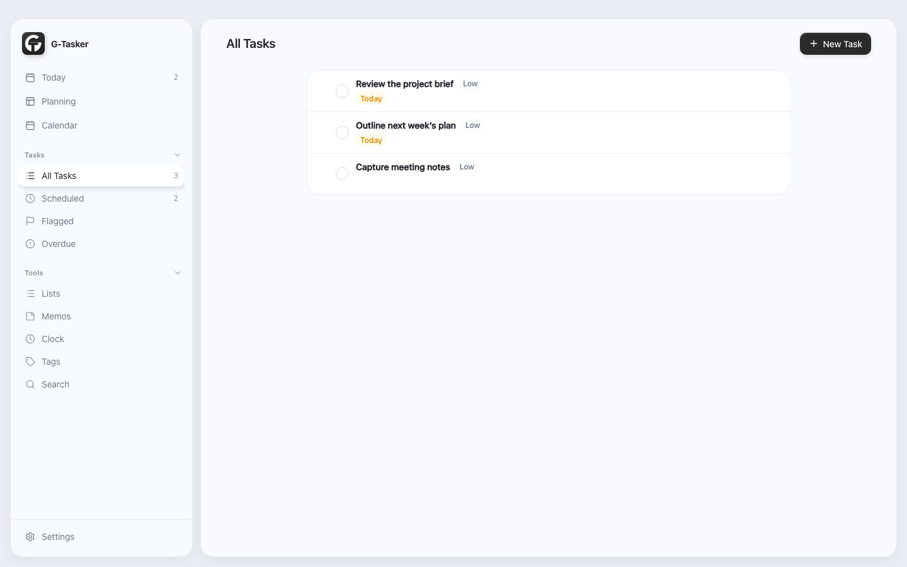
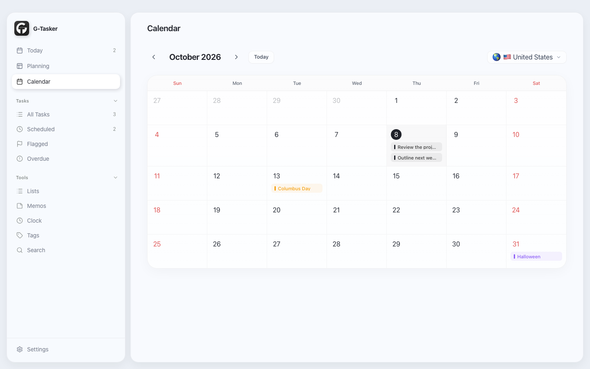

<div align="center">
  

  # G-Tasker

  **A local-first workspace for tasks and time.**

  Keep the work you need to do, the ideas you want to keep, and the time you have in one place.

  [**Download v0.9.0 for macOS (Apple Silicon)**](https://github.com/Gerahamu/G-Tasker/releases/download/v0.9.0/G-Tasker-0.9.0-macOS-arm64.dmg) · [Release notes](https://github.com/Gerahamu/G-Tasker/releases/tag/v0.9.0)
</div>

## About this beta

G-Tasker is a personal planning app built around local data. Tasks, lists, notes, plans, and clocks live in one desktop window. The app does not require an account or a server for its core features. Business data is stored on your Mac through IndexedDB; preferences use local storage.

**v0.9.0 macOS Public Beta** is the first desktop download published from the current Electron codebase. The previous v0.2.0 release represented an older web-only version and remains available in the release history.

## A look inside

These are screenshots of the running v0.9.0 interface in a fresh profile. They contain demonstration data only.

| Tasks | Calendar |
| --- | --- |
|  |  |

## What you can do

- **Organize tasks:** use Today, Scheduled, All, Flagged, and Overdue views; create custom lists and tags; set priority, dates, reminders, recurrence, subtasks, and notes. Task drafts let you pause and resume creation.
- **Capture and plan:** keep quick ideas and memos, search across your workspace, and create day, week, month, or custom-period plans with time blocks.
- **Work with time:** browse a calendar with date markers, holidays, and lunar dates where applicable; use world clocks, a stopwatch, countdowns, and alarms.
- **Make it yours:** choose light, dark, or system appearance, adjust text size, and use the Chinese, English, or Japanese interface. Export a JSON backup from Settings.
- **Use desktop conveniences:** the macOS app provides a quick memo window and integrates supported reminders with macOS notifications.

## Install on macOS

**Requirements:** Apple Silicon Mac (arm64), macOS 13.0 or later according to the app bundle's minimum-version setting. This beta was built and checked on an Apple Silicon Mac; other macOS versions have not been tested for this release. There is no Intel build.

1. Download the [v0.9.0 DMG](https://github.com/Gerahamu/G-Tasker/releases/download/v0.9.0/G-Tasker-0.9.0-macOS-arm64.dmg).
2. Open the DMG and drag **G-tasker.app** to **Applications**.
3. Open the app from Applications. Allow notifications if you want reminders.

The app has an **ad hoc code signature** for bundle integrity, but it is **not signed with an Apple Developer ID and is not notarized**. macOS may block the first launch. If you trust this download, try opening the app, then go to **System Settings → Privacy & Security → Open Anyway** and confirm the prompt. [Apple explains this exception process](https://support.apple.com/en-us/102445). Do not disable Gatekeeper globally.

## Data and current limits

G-Tasker is local-first. There is no account sync or cloud backup. Settings can export a JSON copy of the local database, but this beta does not provide an in-app JSON restore flow. Keep a separate backup before replacing or removing the app. Browser mode must remain open for browser-based notifications; desktop notification behavior depends on macOS permissions and scheduling. This is a public beta, so please report reproducible issues through [GitHub Issues](https://github.com/Gerahamu/G-Tasker/issues).

## Development

**Stack:** Electron 44, React 19, TypeScript 6, Vite 8, Tailwind CSS 4, React Router 7, Zustand 5, Dexie and IndexedDB, date-fns, lunar-typescript, dnd-kit, and Playwright.

**Tools:** Node.js 22.13.0 or later and npm 10.9.0 or later. A Mac is required for the current desktop packaging script.

```bash
git clone https://github.com/Gerahamu/G-Tasker.git
cd G-Tasker
npm ci
npm run dev
```

For a desktop development run or a local Apple Silicon package:

```bash
npm run desktop
npm run build:mac
```

The current packaging script produces `release/G-tasker-darwin-arm64/G-tasker.app`. The downloadable DMG wraps that verified app bundle. For checks, run `npm run test:data`, `npm run typecheck`, and `npm run lint`; browser end-to-end coverage is available with `CI=1 npx playwright test --reporter=list`.

## Status and direction

v0.9.0 is a macOS public beta. Near-term work is focused on release feedback, reliable data handling, and clearer installation. Developer ID signing and notarization, an Intel build, and a supported restore flow are future work; none is included in this release. Windows and mobile packages have not been published from this codebase.
